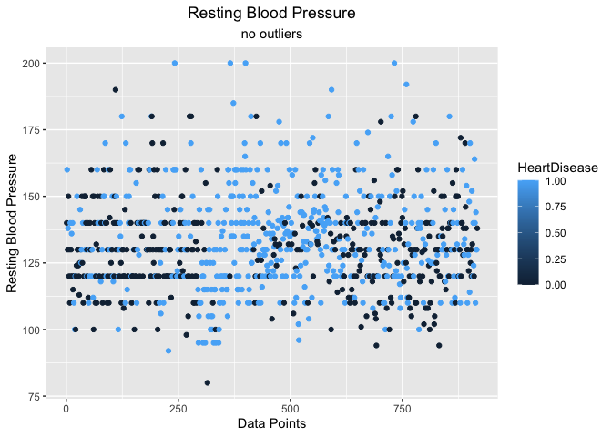
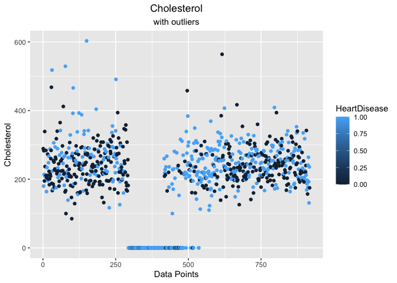
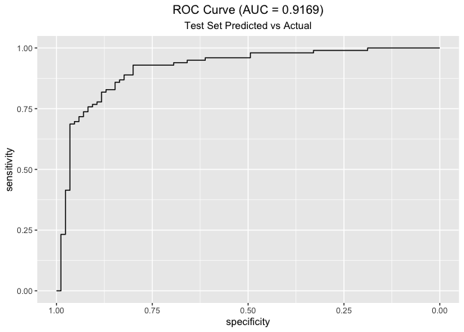

1.5em

# Introduction

Cardiovascular diseases (CVDs) are the number one cause of death
globably, taking an estimated 17.9 million lives each year. This
accounts for 31% of all deaths worldwide. Four out of five CVD deaths
are due to hear attacks and strokes, and one-third of these deaths occur
prematurely in people under 70 years of age. Cardiovascular disease are
conditions that affect the structures or function of your heart, such
as: abnormal heart rhythms or arrhythmias, aorta discease, marfen
syndrome, congenital heart disease, coronary artery disease, etc. Heart
failure is a common event caused by CVDs. The dataset that I am using
contains eleven predictive values that can be used to predict a possible
heart disease. The dataset was retrieved from Kaggle[^1]. The data is
the combination of five different datasets [^2] that total 918
non-duplicate observations.

The data is broken down into the eleven predictive values below:

- Age: age of the patient \[years\]
- Sex: sex of the patient \[M: Male, F: Female\]
- ChestPainType: chest pain type \[TA: Typical Angina, ATA: Atypical
  Angina, NAP: Non-Anginal Pain, ASY: Asymptomatic\]
- RestingBP: resting blood pressure \[mm Hg\]
- Cholesterol: serum cholesterol \[mg/dl\]
- FastingBS: fasting blood sugar \[1: if FastingBS \> 120 mg/dl, 0:
  otherwise\]
- RestingECG: resting electrocardiogram results \[Normal: Normal, ST:
  having ST-T wave abnormality (T wave inversions and/or ST elevation or
  depression of \> 0.05 mV), LVH: showing probable or definite left
  ventricular hypertrophy by Estes’ criteria\]
- MaxHR: maximum heart rate achieved \[Numeric value between 60 and
  202\]
- ExerciseAngina: exercise-induced angina \[Y: Yes, N: No\]
- Oldpeak: oldpeak = ST \[Numeric value measured in depression\]
- ST_Slope: the slope of the peak exercise ST segment \[Up: upsloping,
  Flat: flat, Down: downsloping\]
- HeartDisease: output class \[1: heart disease, 0: Normal\]

People with cardiovascular disease or who are at high cardiovascular
risk (due to the presence of one or more risk factors such as
hypertension, diabetes, hyperlipidaemia or already established disease)
need early detection and management. Therefore, can we determine if
someone is more prone to cardiovascular disease, given the features?

I will be using 20% of the data to test and verify the model and will be
verifying the accuracy using AUC from ROC curve.

# Analysis

## Data Cleaning:

The first thing that should be done on any dataset is to plot the data
and run basic analysis on each of the predictors. When reviewing the
data, it was noticed that there were two glaring issues with the data.
The first occurred in the `RestingBP`.

## Resting Blood Pressure

<!-- -->

We can see in the above that we have a resting blood pressure value of
**0**, which would mean that this person is dead. I could have used
Bayes to impute the incorrect/missing value, but I decided to remove it
because in the end one less data point won’t truly affect the analysis.
Also there really isn’t a point to set up a Bayes model to impute a
single point, in my opinion, especially with how many good points we
still have. After removing the outlier, we can see the new data appears
to be within the necessary values for resting blood pressure.

<!-- -->

## Cholesterol

The second issue I found while exploring the data was with the
`Cholesterol`. The dataset shows that a range of indexes have a
`Cholesterol` value of zero, which also like resting blood pressure is
impossible.

<!-- -->

These zero values for `Cholesterol` account for *171* values, which is
approximately **18%** of the data set. One of the other things to note
is of the `171` incorrect values, `151` of them are heart disease. This
is a significant value. Normally when encountering a data set with this
large of incorrect data, the goal would be to either throw out the data
that is incorrect or supply the mean of the observed values for all the
missing data points. Even then this is a significant amount of incorrect
data.

I have decided to use Bayes MCMC to try and impute the data. I used
non-informative priors allowing the data set to determine what the
values should be. The model that was used for this can be seen in
`Appendix A: Cholesterol Imputed`. Looking at the missing values, it
appears that one of the five data sets didn’t have correct values for
`Cholesterol`. Again normally these would be thrown out, but I decided
to use a Bayesian model to find what the imputed values would be. Due to
the assumption that it is an incorrect data set, I didn’t split the data
into training and test sets for the imputation. I am using different
models for each to make sure that there isn’t any leakage for
determining the imputed values to later predicting the test set.

The reason I have decided to split them was due to the fact that this
data set is a combination of 5 different data sets from different areas
that have been combined to create a single data set. I am making the
assumption that because the missing values are all relatively next to
each other, that they all came from the same data set. More than likely
the data would not have the missing values and, therefore, would not
need to be imputed before running through the model. I could have made
adjustments to the model to impute the missing Cholesterol-values for a
training data set and then using this distribution determine what it
would be for the test data set. I decided instead to first impute all
the values and then split them into training and test sets, which could
then be run through a prediction model.

After running the data through the stan model, I was able to get imputed
data points. Below you can see the graph of the missing values by
themselves.

<!-- --><!-- -->

We can see that there is slight variation as compared to the mean value,
but they aren’t as varied as the original data points. No matter what
was changed in the model, I was unable to get the wide variation that is
seen the other data points, but the imputed data appears to make logical
sense.

# Results

## Predictive Model:

Now that I have a “cleaned” data set with filled in missing values for
Cholesterol, I was able to create a logit regression model. This Stan
model can be seen in `Appendix B: Logit Regression`.

I am building a simple Bernoulli logit model with normal prior for the
betas.

$$\alpha = \beta_0 + X * \beta_{1..k}$$

Where: \* X: predictive variables \* $\beta_0$: intercept coefficient \*
$\beta_{1..k}$: coefficients for each of the predictive variables

Once the Bayesian model has been trained on the training set, I was able
to supply the test variables (`X.test`) to the model. This allows me to
predict the values for y on the test set. Grabbing the mean for all the
different MCMC chains we are able to get the predicted values for y upon
the test set.

``` r
# statistics
ypred <- fit$summary('y_pred')$mean
ypred
```

    ##   [1] 0.13725 0.23000 0.02475 0.86450 0.88675 0.45525 0.06475 0.96675 0.27550
    ##  [10] 0.08400 0.02025 0.10850 0.16100 0.96275 0.04075 0.47875 0.95175 0.90725
    ##  [19] 0.13050 0.95075 0.29975 0.16325 0.95600 0.24150 0.98250 0.92375 0.27200
    ##  [28] 0.08875 0.09375 0.99650 0.36025 0.99300 0.78100 0.93850 0.14475 0.97575
    ##  [37] 0.18200 0.18650 0.06825 0.43300 0.91900 0.38900 0.01225 0.93875 0.00375
    ##  [46] 0.01450 0.03725 0.93800 0.87350 0.72050 0.31000 0.12525 0.94525 0.37825
    ##  [55] 0.12950 0.04775 0.92825 0.95950 0.89450 0.74925 0.59675 0.49350 0.92750
    ##  [64] 0.02600 0.95725 0.92225 0.97250 0.93550 0.48400 0.45050 0.81175 0.51100
    ##  [73] 0.73725 0.96300 0.68125 0.97925 0.04850 0.91400 0.67025 0.82250 0.97925
    ##  [82] 0.72300 0.99225 0.93150 0.97300 0.99125 0.98575 0.98000 0.53775 0.08425
    ##  [91] 0.99900 0.59900 0.97875 0.85600 0.97675 0.78700 0.97625 0.31400 0.94850
    ## [100] 0.89175 0.92675 0.99175 0.49825 0.53875 0.93575 0.92625 0.12750 0.95725
    ## [109] 0.97125 0.87900 0.94825 0.98225 0.94875 0.16850 0.95525 0.98675 0.95275
    ## [118] 0.92225 0.86575 0.70575 0.91600 0.58325 0.44875 0.07950 0.00925 0.87175
    ## [127] 0.09075 0.04175 0.16000 0.13225 0.04200 0.93925 0.43050 0.11300 0.87175
    ## [136] 0.91175 0.07725 0.71875 0.62150 0.99725 0.96875 0.06300 0.14625 0.73625
    ## [145] 0.13925 0.97775 0.01550 0.31200 0.31975 0.74825 0.02075 0.25525 0.17650
    ## [154] 0.36200 0.07275 0.49425 0.67775 0.04950 0.14850 0.93350 0.72350 0.35775
    ## [163] 0.23675 0.44100 0.13550 0.95575 0.10000 0.95425 0.92350 0.08775 0.41275
    ## [172] 0.49650 0.54475 0.96450 0.08650 0.96000 0.32050 0.03550 0.02775 0.17475
    ## [181] 0.35950 0.24875 0.97725 0.30000

Now that we have the predicted values, let us check the AUC for the ROC
curve to determine the accuracy of the model.

    ## Setting levels: control = 0, case = 1

    ## Setting direction: controls < cases

<!-- -->

The ROC curve looks really good for this model.

We can see that we have a decent score for the Bayesian predictive model
with imputed Cholesterol values.

# Conclusion

In my project I have shown that we can use a Bayesian model to impute
missing/incorrect values. This allows us to have more data to model in
order to determine accuracy. We can see that using the imputed results
can allow for a fairly accurate model that could be used to determine
cardiovascular disease. Ideally, we would want cleaner data especially
working with something so vital as the health of patients. Using
Bayesian models has allowed us to retain data to help the model perform
better overall.

Building a Bayesian model is fairly straightforward for imputing the
incorrect data. This actually makes me wonder why the general consensus
with the data science community is just to use the mean or median value.
Determining which to use would be determined by the distribution of the
data. It would be significantly easier to use the mean if the data is
normally distributed, but if you have left or right shifted distribution
it would affect the accuracy of using the mean/median. Whereas by
imputing with a Bayesian model, we would be able to get much more
accurate data that is related to the data’s distribution.

I would like to expand on this in the future to determine how a Bayesian
logit predictive model compares to a general logit model. I would also
like to compare the difference between dropping the missing values vs
actual.

# Appendix

## Appendix A: Cholesterol Imputed

    ## // The input data is a vector 'y' of length 'N'.
    ## data {
    ##   int<lower=0> N;       // observations
    ##   int<lower=0> N_obs;   // observed variables
    ##   int<lower=0> N_mis;   // missing variables
    ##   array[N_obs] int<lower=1, upper=N_obs + N_mis> ix_obs;  // index of obs x's
    ##   array[N_mis] int<lower=1, upper=N_obs + N_mis> ix_mis;  // index of mis x's
    ##   
    ##   int<lower=1> K;       // predictor variables (reduced by one for Cholesterol)
    ##   
    ##   matrix[N, K] X;       // The X's without the imputed column (Cholesterol)
    ##   vector[N_obs] x_obs;  // Actual x values that were observed
    ##   array[N] int<lower=0, upper=1> y;
    ## }
    ## 
    ## parameters {
    ##   real alpha;           // intercept
    ##   vector[K] betas;      // coefficients
    ##   real b_chol;          // Cholesterol coefficient
    ##   vector[N_mis] x_mis;  // Missing values for cholesterol
    ##   
    ##   real mu;
    ##   real<lower=0> sigma;
    ## }
    ## 
    ## transformed parameters {
    ##   vector[N] X_chol;        // Imputed Cholesterol values
    ##   X_chol[ix_obs] = x_obs;  // Observed Cholesterol values
    ##   X_chol[ix_mis] = x_mis;  // Missing Cholesterol values
    ## }
    ## 
    ## model {
    ##   alpha ~ normal(0, 100);
    ##   betas ~ normal(0, 100);  // Non-informative prior
    ##   b_chol ~ normal(200, 100); // Non-informative prior
    ## 
    ##   mu ~ normal(300, 50);    // Non-informative prior, but expecting to be around the mean of dataset
    ##   sigma ~ normal(0, 10);
    ##   X_chol ~ normal(mu, sigma);  // Impute the missing X values
    ##   
    ##   y ~ bernoulli_logit(alpha + X * betas + X_chol * b_chol);
    ## }

## Appendix B: Logit Regression

    ## // The input data is a vector 'y' of length 'N'.
    ## data {
    ##   int<lower=0> N;       // observations
    ##   int<lower=0> N_t;     // test oberservations
    ##   int<lower=1> K;       // coefficients
    ##   
    ##   matrix[N, K] X;
    ##   
    ##   matrix[N_t, K] X_test;
    ##   array[N] int<lower=0, upper=1> y;
    ##   vector[N_t] y_test;
    ## }
    ## 
    ## parameters {
    ##   real alpha;    // intercept
    ##   vector[K] betas;
    ## }
    ## 
    ## model {
    ##   alpha ~ uniform(-50, 50);
    ##   // alpha ~ normal(0, 10);
    ##   betas ~ normal(0, 10);
    ##   y ~ bernoulli_logit(alpha + X * betas);
    ## }
    ## 
    ## generated quantities {
    ##   vector[N_t] y_pred;
    ##   
    ##   for (n in 1:N_t) {
    ##     y_pred[n] = bernoulli_logit_rng(alpha + X_test[n] * betas);
    ##   }
    ##   
    ##   // In order to calculate Bayesian R2:
    ##   // http://www.stat.columbia.edu/~gelman/research/unpublished/bayes_R2.pdf
    ##   real BR2;
    ##   BR2 = variance(y_pred) / (variance(y_pred) + variance(y_test - y_pred));
    ## }

[^1]: <https://www.kaggle.com/datasets/fedesoriano/heart-failure-prediction?sort=recent-comments>

[^2]: fedesoriano. (September 2021). Heart Failure Prediction Dataset.
    Retrieved 4/24/2022 from
    <https://www.kaggle.com/fedesoriano/heart-failure-prediction>.
